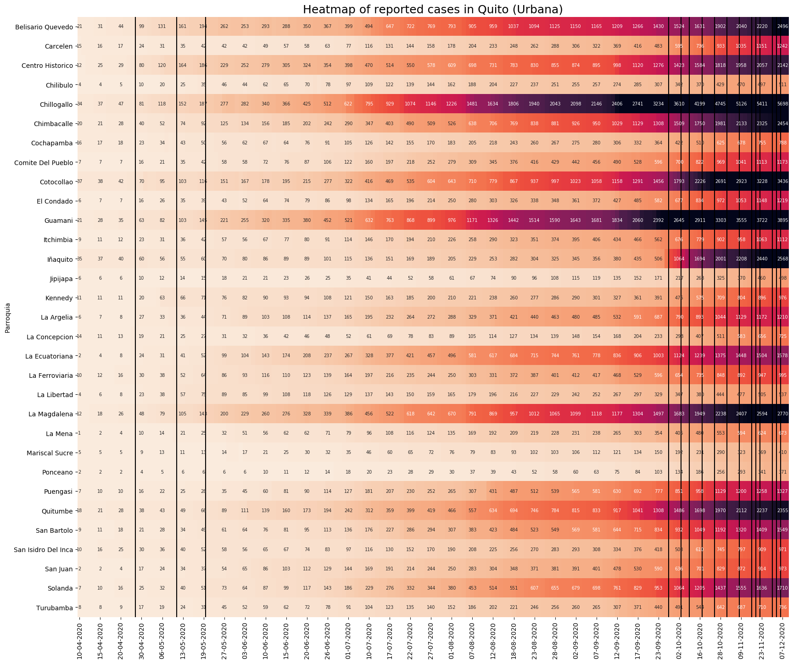

# Report of COVID-19 cases in Pichincha - Ecuador
 
- [Overview](#overview)
- [Motivation](#motivation)
- [Technical Aspect](#technical-aspect)
- [Visualization](#visualization)
- Next steps

## Overview

The objective of this project is to build a data set from information contained in pdf files and create heatmaps for visualization. The data is the report of COVID-19 cases in the province of Pichicha, Ecuador. This report is created by the authorities in the province. For pdf-scraping I used camelot and tabula.

## Motivation

Most of the official bulk data in the country is not available from open sources at the current moment (July 2020). However, official authorities in the province of Pichincha do publish a report of daily cases in a pdf ([site](https://coe-pichincha.senescyt.gob.ec/situacion-pichincha/)). It would be possible to copy and paste this data into an Excel file, although it would be a tiresome task. Therefore, this project aims to automate this process by reading the pdf, extracting the table, merging it with the data of previous dates and storing it as csv file for further analysis.

In addition, I want to create a heatmap with the data for the first three months of the reports (April, 10 - July, 10). However, there are several dates when the report was not published or it did not have detailed data in this period. Specifically, there were 21 days with no data out of 92 days in the period, which is 23% of the total:
- April: 5 days with no report
- May: 9 days with no report
- June: 3 days with no report
- July: 4 days with no report

It is important to note that the official data is only showing the reported cases of positive tests for COVID-19 each day. Due to the limited amount of tests and their slow processing time, the real number of cases is considered to be higher than what it is reported.

Nonetheless, this project is a useful exercise to understand the logic behind web scraping and a reasonable task to test my knowledge in Python, as both a beginner and self taught user of this language.

## Technical Aspect

There are three scripts in the project:

- [vfunc.py](vfunc.py): this script has helper functions for the other two scripts
- [vmain.py](vmain.py): this script does the extracting, formatting, merging and updating of data. I use two libraries to read the pdfs: camelot and tabula. Initially, I only used camelot, but the pdf format changes constantly: Therefore, camelot could not read correctly the file for the reports at the beginning of July. It would have been possible to create a function to correct the problem and keep using camleot. However, it was easier to switch to tabula for these reports and solve the issue with one line of code. For data wrangling, I use pandas and numpy. Nonetheless, the update function may not work for future dates, because of new changes in the pdf format of the reports. This function is commented out. More in Next steps.
- [vvisualize.py](vvisualize.py): this script is where I build the heatmaps to show the evolution in the number of cases by location in the province during this period. To create heatmaps, I use seaborn. I created a loop to generate heatmaps for each of the city councils (cantones) in the province, divided by area (rural and urban).

The file 'dates.txt' does need to be manually updated, although this could also be automated in a further development of the project. For the time being, to update this file I need to go to the site where the pdfs are and check the dates where the report was published. I add the last part of the url into the txt file.

## Visualization

This data focuses only on the city of Quito, due to the fact that it has the largest population and biggest proportion of COVID-19 cases in the province. The heatmap allows to show how the trend in the reports changes throughout the city in this period. The three vertical lines in this heatmap represent three periods where there were no daily reports for more than one day. Therefore, the increase of cases appear to be significant from one day to the other, but this is only due to the lack of data in the missing days. 

It is interesting to see how certain parts of the city were more affected at the beginning, but apparently managed to control the rate of contagion in the next weeks. Most parts of the city that reported more than 100 cases in May, reached over 400 cases at the beginning of July. Guamani and Chillogallo are located next to each other in the southern region of the city and combined have over 1 400 of the cases in the city.

