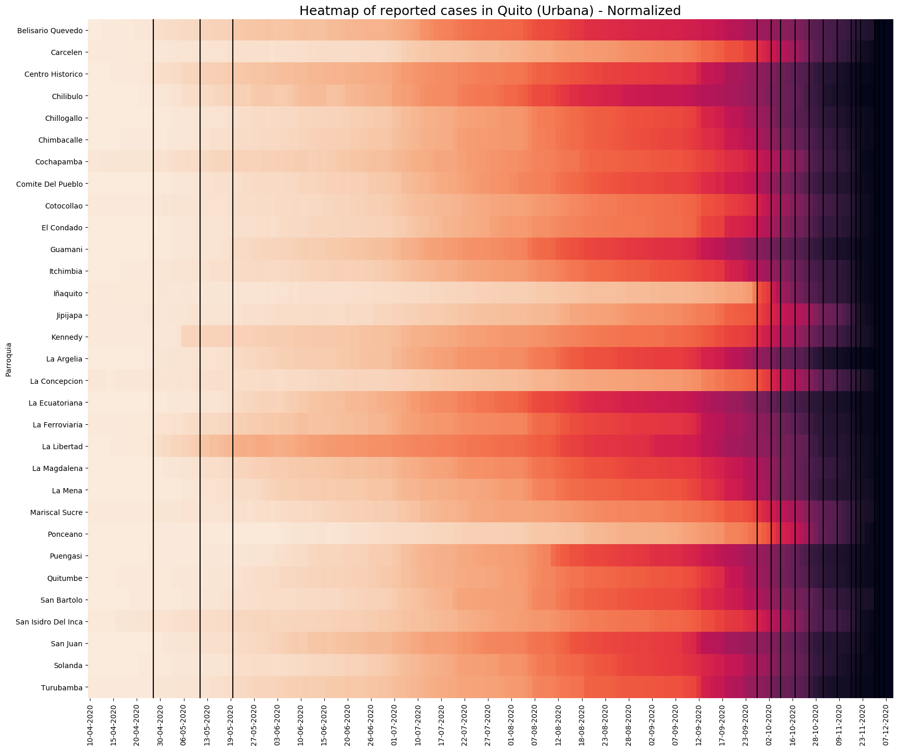
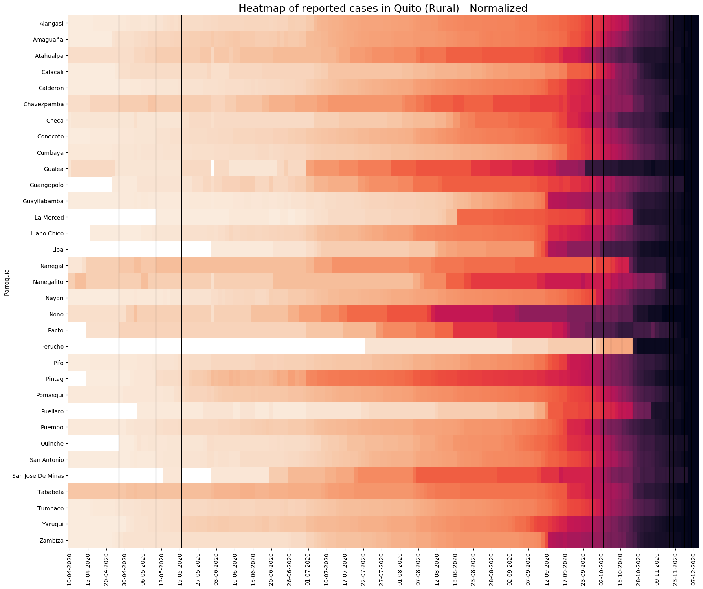

# Report of COVID-19 cases in Pichincha - Ecuador
 
- [Overview](#overview)
- [Motivation](#motivation)
- [Technical Aspect](#technical-aspect)
- [Visualization](#visualization)
- [Next steps](#next-steps)

## Overview

The objective of this project is to build a data set from information contained in pdf files and create heatmaps for visualization. The data are the reports of COVID-19 cases in the province of Pichicha, Ecuador. This report is created by the authorities in the province. For pdf-scraping I used `camelot` and `tabula`.

## Motivation

Most of the official raw data in the country is not available from open sources at the current moment (July 2020). However, official authorities in the province of Pichincha do publish a report of daily cases in a pdf ([site](https://coe-pichincha.senescyt.gob.ec/situacion-pichincha/)). It would be possible to copy and paste this data into an Excel file, although it would be a tiresome task. Therefore, this project aims to automate this process by reading the pdf, extracting the table, merging it with the data of previous dates and storing it as csv file for further analysis.

In addition, I want to create a heatmap with the data for the first three months of the reports (April, 10 - July, 10) and after that I will update this data every month until December 2020. However, there are several dates when the report was not published or it did not have detailed data during this period. Specifically, there were 36 days with no data out of 184 days in the period, which is around 19% of the total:
- April: 5 days
- May: 9 days
- June: 3 days
- July: 6 days
- August: 2 days
- September: 4 days
- October: 7 days

It is important to note that the official data is only showing the reported cases of positive tests for COVID-19 each day. Due to the limited amount of tests and the slow processing time, the real number of cases is supposed to be higher than what it is reported. Another issue to consider is the occasional report of lower number of cases in different parts of the city. These reports are supposed to show the cumulative number of cases. However, authorities cite misclassification or changes in the data management system as the reason why certain parts of the city report a lower number of cases than days before. These issues have cast doubt on the validity of this data and even authorities themselves have recognized that the reported number of cases does not represent the entire picture.

In this sense, this project does not aim to be an epidemiological analysis. The goal is to visualize data in a more informative way. Moreover, this is a useful exercise to understand the logic behind web scraping and a reasonable task to test my knowledge in Python, as both a beginner and self taught user of this language.

## Technical Aspect

There are three scripts in the project:

- [vfunc.py](vfunc.py): this script has helper functions for the other two scripts
- [vmain.py](vmain.py): this script does the extracting, formatting, merging and updating of data. I use two libraries to read the pdfs: `camelot` and `tabula`. Initially, I only used `camelot`, but the pdf format changes constantly. Unfortunetaly, this library could not read correctly the pdfs for the reports at the beginning of July. It would have been possible to create a function to correct the problem and keep using the same library. However, it was easier to switch to `tabula` for these reports and solve the issue with one line of code. For data wrangling, I use `pandas` and `numpy`. There is an update function, which may not work for future dates, because of new changes in the pdf format of the reports. This function is commented out. More in Next steps.
- [vvisual.py](vvisual.py): this script is where I build the heatmaps to show the evolution in the number of cases by location in the province during this period. I use `seaborn` to create these heatmaps. I created a loop to generate heatmaps for each of the city councils (cantones) in the province, divided by area (rural and urban). This files are in the [_heatmaps_](/heatmaps) folder.

The file [dfiles.txt](dfiles.txt) has the names and dates of the reports. This file does need to be manually updated, although this could also be automated in a future development of the project. For the time being, to update this file I need to go to the site where the pdfs are and check the dates when the report was published. I add the last part of the url into the file, as in previous dates. The update function in vmain.py looks for the missing dates and adds the data to the previous data frame using dupdate.txt.

## Visualization 
### (updated until October 2020)

This data focuses only on the city of Quito, due to the fact that it has the largest population and biggest proportion of COVID-19 cases in the province. The heatmap allows to show how the trend in the reports changes throughout the city in this period. The five vertical lines in this heatmap represent three periods where there were no daily reports for more than one day. Therefore, the increase of cases appear to be significant from one day to the other, but this is only due to the lack of data in the missing days. 

It is interesting to see how certain parts of the city were more affected at the beginning, but apparently managed to control the rate of contagion in the next weeks. Most parts of the city that reported more than 100 cases in May, reached over 400 cases at the beginning of July. Guamani and Chillogallo are located next to each other in the southern region of the city and combined had over 1 400 of the cases in the city by July 10th. Two months later, these were still the leading areas by number of cases in the city with 3 800 confirmed cases.

To check the dates for highest and lowest number of cases for each part of the city, I used data normalization. This heatmap offers a better contrast to identify the parts of the city where the number of cases have grown at a lower rate than the most affected regions. If the color is darker at an early date, it means that the number of cases stayed relatively constant until it reached its peak.

In the rural area, the same heatmaps suggest that the situation is less severe. Calderon and Conocoto are the most affected locations. The number of cases in several parts of the city are under 300. 

## Next steps

As long as the number of cases are reported, I hope to update this project monthly with new data. Previous heatmaps are stored in the folder `heatmaps`. There are two main tasks that I would like to explore in this project. The first one is to implement a function for the program to identify the table in the pdf automatically. For now, I have to manually set the page where the data is located. This represents a big challenge due to the permanent change of format of the pdf. Another task is to check for the available reports without having to manually insert this information in the .txt file after checking the webpage. This is relatively easier to do and I have already begun to create a new function to do this. However, the issue here again is that the names of the files do not follow the same pattern and, in some cases, do not even have the same encoding.
